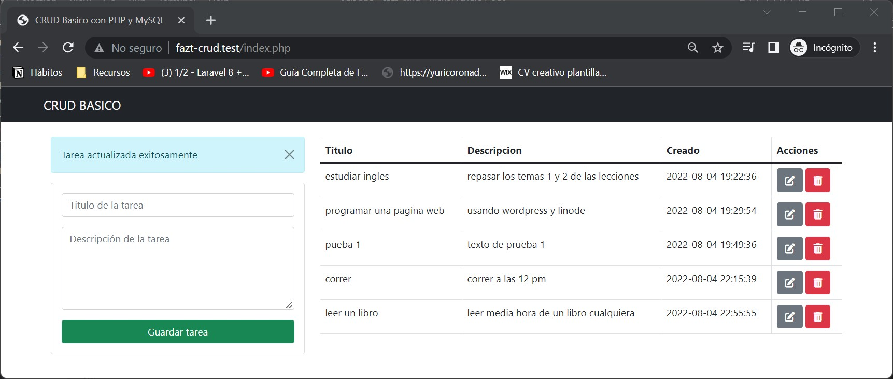

# CRUD Básico PHP y MySQL

Esté CRUD básico se desarrolló por Yuriria Coronado, como ejercicio práctico basado en el canal de [faztweb.com](https://www.faztweb.com) con el objetivo de aplicar las funcionalidades de crear, consultar, actualizar y eliminar sobre una base de datos utilizando php puro.

## Vista previa

## Tecnologias utilizadas

* HTML
* Bootstrap
* PHP
* MySQL

## Requerimientos y uso

1. Crear una base de datos llamada **crud_basico**
2. Crear una tabla con cuatro columnas:
    - id (PRIMARY KEY)
    - titulo (VARCHAR)
    - descripcion (TEXT)
    - created_at (TIMESTAMP)[Valor predeterminado: CURRENT_TIMESTAMP]

## Desarrollado

Desarrollado por Yuriria Coronado